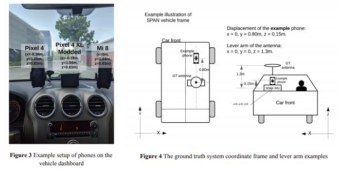
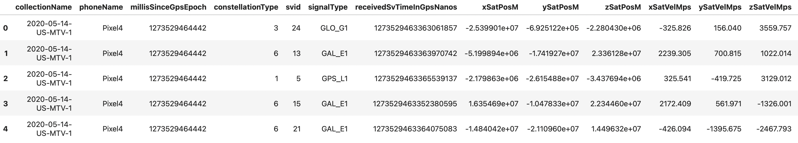

# Accuracy in Android Positioning

## An Analysis of Android Positioning Data Versus GroundTruth GPS Positions

*Final Capstone Project for Galvanize Data Analytics Immersive, Cohort 1*

*by Joanna Vasquez*

# Background

Since 2016, Android smartphones have supported self-awareness of location using a Global Navigations Satellite System (GNSS). Essentially:

*   Smartphones have embedded GNSS receivers which listen to signals emitting
    from satellite systems such as the US's GPS, the European Union's Galileo
    and Russia's GLONASS

*   Upon being turned on, the receivers listen to signals which are constantly
    being emitted from the satellites

*   Using theories such as time difference of arrival, frequency difference of arrival,
    received signal strength indication, the receiver calculates its position and records it to the Android's device

*   The consumer is able to use a location-dependent application such as Google Maps

  

# Data Overview

In 2021, Google launched a competition to attempt and calculate Android receivers down to the decimeter or centimeter. As part of their competiton, they outfitted a vehicle with multiple phones as well as ground-truth data (actual location of the phone at the time of GNSS receiver readings)

  

The result was over 20 trial runs with resulting datapoints.

# Data Exploration

  Each Trial Run resulted in:
        - Derived locations as determined by the GNSS measurements
        - Ground Truth Locations File
        - Raw GNSS log measurements

The derived locations data resulted of 20 columns of categorical data pertaining to the phone and trial and quantitative data pertaining to receiver readings such as signal type, speed of satellite, drift of satellite, time of signal, and delays in signal speed due to signal traveling through the ionosphere and troposphere :

      'collectionName',
      'phoneName',
      'millisSinceGpsEpoch',
       'constellationType',
       'svid',
       'signalType',
       'receivedSvTimeInGpsNanos',
       'xSatPosM',
       'ySatPosM',
       'zSatPosM',
       'xSatVelMps',
       'ySatVelMps',
       'zSatVelMps',
       'satClkBiasM',
       'satClkDriftMps',
       'rawPrM',
       'rawPrUncM',
       'isrbM',
       'ionoDelayM',
       'tropoDelayM

  

The Ground Truth data was easier to decode and resulted in human-readable locations. The data was composed of categorical information identifying the phone and trial and quantitative informatin such as the latitude and longitude, the current time in milliseconds, the age of the location fix, the speed the receiver was moving at and the direction the receiver was heading towards (if mobile)

'collectionName',
'phoneName',
'millisSinceGpsEpoch',
'latDeg',
'lngDeg',
'heightAboveWgs84EllipsoidM',
'timeSinceFirstFixSeconds',
'hDop',
'vDop',
'speedMps',
'courseDegree'

  

# Scientific Questions:

This case study will seek to answer:

  What factors increase accuracy in GNSS measurements ?

  What relationships exist between accuracy of location and number of satellites   involved in location calculation ?

  Is there a maximum ceiling at which point increasing the number of satellites
  has no bearing on improving

As a null hypothesis, I assess that an increase of satellites over 4 will not reduce error in location measurements.

# Locational Accuracy Findings

# Next Steps

# References

https://en.wikipedia.org/wiki/GNSS_positioning_calculation

https://www.kaggle.com/c/google-smartphone-decimeter-challenge/overview

https://www.kaggle.com/google/android-smartphones-high-accuracy-datasets

https://barbeau.medium.com/gnss-interrupted-the-hidden-android-setting-you-need-to-know-d812d28a3821

https://blog.bliley.com/the-differences-between-the-5-gnss-satellite-network-constellations

